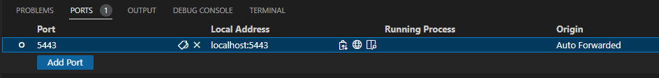

# Helm Chart to deploy DaytraderMicroservice

This repo contains a Helm chart that can be used to deploy [Daytrader Microservices](https://github.com/ssmtariq/daytrader-microservice) onto a supported Kubernetes cluster.

## Using the Chart

### Installation

When kubernetes cluster is ready, 
- Clone the `deploy-daytrader` app in your root node i.e. `node-0`. You can use the command `git clone https://github.com/ssmtariq/deploy-daytrader.git`
- Open terminal in `node-0` and change directory to `deploy-daytrader` app by `cd deploy-daytrader`
- [Optional] To change the docker image tag to be deployed
    - Open `helm/Chart.yaml` file and update the field `appVersion`. For instance, default `appVersion: 4.0.18` to `appVersion: optimized`.
- Check the `.env` file and set 
    - `APP_VERSION` which represents the **tag** in **docker-hub** for DayTrader microservice images
    - `REPOSITORY_ROOT` which represents the **repository name** in **docker-hub** for DayTrader microservice images
- Open the `helm/values.yaml`file
    - Update the `cluster->dns` property with dns value (not IP address) of the root node `node-0` of your kubernetes cluster. Make sure you typed them in **lower-case**
    - Update the `image->namespace` with docker-hub repo name (if-required)
- Now, to install DayTrader microservices run `sh scripts/install-daytrader.sh`.

### Running

Once installed, run `sh scripts/port-forward.sh` to forward the daytrader application to http://localhost:5443.

Keep the `scripts/port-forward.sh` script running in a terminal and then the daytrader app will be available at your machine at http://localhost:5443/

Try `curl https://localhost:5443/` before checking from the web browser
If you run the commands from vscode terminal, also check if the PORT is being forwarded correctly

### Updating

To update the helm chart or running images, make any changes required to the templates and run `sh scripts/upgrade-daytrader.sh`.

### Uninstalling

To uninstall the application, run `sh scripts/uninstall-daytrader.sh`.

### Testing
- While keeping the script `scripts/port-forward.sh` running open the url `https://localhost:5443/` in your browser to browse DayTrader
- Save test result in a file for example `kubectl logs --follow -l app=daytrader-portfolios>DT-10K-requests-original-iteration-1.txt`
- Go to `Configuration` tab and follow the configuration steps update upto `(Re)-populate  DayTrader Database` sequantially
- Open `Blazemeter` Google Chrome extension (assuming you're using Google chrome browser) and ensure that you are Logged in
- On `Blazemeter` start recording
- Click the `Test DayTrader Scenario`, then click `Quotes/Trade` and then click the option (button) `buy`
- Now stop recording in `Blazemeter` and save the test plan as `.jmx` file by clicking `Save as` option
- Open the `.jmx` file in **Apache JMeter** (currently using version 5.4.3), add 2 listeners `View Results Tree`, `Summary Report` under `Thread Group->Test`
- Set filename to the above listeners just added
- Update Thread Group for `Number of Threads`, `Ramp-up period` and `Loop Count` as required. For instance 16, 16, and 625
- Now start testing and observe result in `View Results Tree`